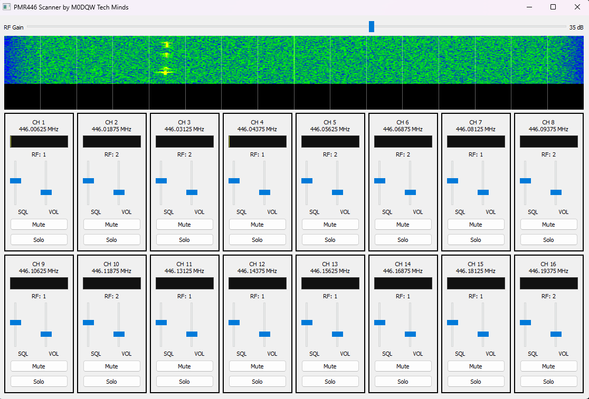

# UK PMR446 Multi-Channel Scanner (RTL-SDR)

A Python + GNU Radio application for monitoring **all 16 UK PMR446 channels simultaneously** using an **RTL-SDR Blog V3** on **Windows 11**.



---

## ⚠️ Important Notes (Please Read First)

- This application **requires GNU Radio** and **cannot be bundled into a single EXE on Windows**
- It runs from **Python inside Radioconda / Conda**
- **GNU Radio is expected to be installed in the Radioconda `base` environment**
- This is intentional and avoids many Windows-specific issues with SDR tooling
- Tested with:
  - **Windows 11**
  - **RTL-SDR Blog V3**
  - **Radioconda**
  - **Python 3.11**
  - **GNU Radio (conda-forge)**

---

## 📦 Hardware Requirements

- RTL-SDR Blog **V3**
- PMR446-capable antenna (UHF ~446 MHz)
- USB 2.0 / 3.0 port

---

## 🧰 Software Prerequisites

### 1️⃣ Install RTL-SDR USB Driver (Zadig)

1. Plug in your RTL-SDR
2. Download **Zadig**  
   https://zadig.akeo.ie
3. Open Zadig
4. Select:
   - Device: `RTL2832U` (or similar)
   - Driver: **WinUSB**
5. Click **Install Driver**

✅ This step is mandatory.

---

### 2️⃣ Install Radioconda (Recommended)

Radioconda is a Conda distribution tailored for SDR use on Windows.

Download and install Radioconda:
https://github.com/ryanvolz/radioconda

Install using default options.

⚠️ **Important:** GNU Radio will be installed into the **`base` environment**.

Restart your PC after installation.

---

## 🧪 Environment Setup (One-Time)

### 3️⃣ Open **Radioconda Prompt**

From the Start Menu:
```
Radioconda Prompt
```

You should see:
```
(base)
```

---

### 4️⃣ Install GNU Radio (base environment)

Make sure you are in the `base` environment, then run:

```
conda install gnuradio
```

⏳ This can take several minutes — this is normal.

Verify installation:

```
python -c "from gnuradio import gr; print('GNU Radio OK')"
```

---

### 5️⃣ Install Python dependencies

Still in the `base` environment:

```
pip install numpy pyqt5
```

---

## 📂 Application Setup

### 6️⃣ Clone this repository

```
git clone https://github.com/TechMindsYT/UK_PMR_Scanner_RTLSDR.git
cd UK_PMR_Scanner_RTLSDR
```

Or download the ZIP from GitHub and extract it.

---

## ▶️ Running the Application

### Recommended method (batch file)

A helper launcher script is provided.

1. Double-click:
```
run_pmr.bat
```

What the script does:
- Uses the **Radioconda base environment**
- Activates GNU Radio correctly
- Launches `pmr_monitor.py`

No manual Conda activation is required.

---

### Manual method (advanced users)

```
conda activate base
python pmr_monitor.py
```

---

## ✅ What You Should See

- Main window opens
- RF Gain slider at the top
- Wide waterfall showing **446.0–446.2 MHz**
- 16 channel panels:
  - Channels 1–8 (top row)
  - Channels 9–16 (bottom row)
- Each channel has:
  - RF level meter
  - Squelch control
  - Volume control
  - Mute / Solo buttons
- Audio plays automatically when a channel opens squelch

---

## 🔧 Troubleshooting

### ❌ “No module named gnuradio”
- Ensure you are using **Radioconda**
- Ensure GNU Radio is installed in the **base** environment
- Verify with:

```
python -c "from gnuradio import gr; print('OK')"
```

---

### ❌ RTL-SDR not detected
- Re-run Zadig
- Confirm **WinUSB** driver is installed
- Unplug / replug the dongle
- Close SDR# or any other SDR apps

---

### ❌ Audio distorted or bleeding between channels
- Reduce **RF Gain** (30–35 is usually ideal)
- Adjust squelch per channel
- Ensure a good antenna and avoid overload

---

## 📝 Notes on Windows & SDR

- GNU Radio on Windows **cannot be packaged into a single EXE**
- Using the **base environment is intentional and recommended**
- This avoids DLL and PATH issues common with SDR projects


---

## 🙌 Acknowledgements

- GNU Radio Project
- RTL-SDR Blog
- Radioconda
- Conda-Forge community
